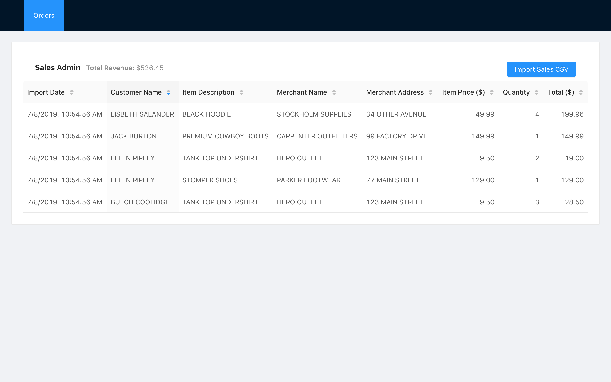

#Sales Admin



## system requirements

```
node v12.4.0+
npm 6.9.0+
```

## installation

```
npm install
```

## running

2 ports are needed to run this example, 3000 and 4000. Once started navigate to http://localhost:3000.

```
npm run start
```

## technology

This example leverages:

- ReactJS as the web framework (client dir)
  - Ant Design leveraged for its open source React components
- ExpressJS/NodeJS as the api server (server dir)
- LokiJS as the persistent data storage

## structure

### client

The web application (client) is built using the "create-react-app" toolkit.
This toolkit handles the transpile and build aspects of react application development.
For the purposes of this demo, the application is running in development mode.

The web application uses the "react-router" library to handle in application page routing.
At the current time, there is only one "route", but this puts architecture in place to grow
the application.

The web application uses the browser supported "fetch" api. This means the application
will run on Edge 14+ , Chrome 42+, Firefox 14+, and Safari 10.1+. A pollyfill can be used
to add support to IE.

Ant design was chosen to be used on top of React in this demo due to its pre-styled nature.
Other frameworks like Material UI could be of use, but due to time constraints Ant design was chosen.

Typescript is not used in this demo due to time constraints, but I highly recommend looking at using
Typescript with React for easier code documentation and compile-time bug catching.

### server

The server is built using Nodejs, ExpressJS, and LokiJS.
NodeJS and ExpressJS are commonly used web server tools which I was familiar with prior to this demo.
I chose to use LokiJS for its in-memory database aspects and persistance to file. I wanted a
minimal setup overhead for deployment, and LokiJS requires nothing more than NPM to setup.

### database

LokiJS is a NoSQL database, so data is stored in document collections. There are 4 collections:

1. Customer: records of all customers in the sales data
2. Merchant: records of all merchants in the sales data
3. Product: records of all products in the sales data
   - A product contains a merchant
4. Order: records of all orders in the sales data
   - An order contains a product, and customer

For simple setup purposes LokiJS is usefull, but to scale this application I would move to non in-memory database,
and if relational requirements arise move to a SQL based database like MySQL or PostgreSQL.

### api

The webapp(port 3000) proxies all its api requets to the server(port 4000)
The following API endpoints are made available in this demo:

- /orders

  - get: returns all orders

    ```
        [
            {
                "customer": {
                "name": "JACK BURTON",
                },
                "product": {
                "description": "PREMIUM COWBOY BOOTS",
                "price": "149.99",
                "merchant": {
                    "name": "CARPENTER OUTFITTERS",
                    "address": "99 FACTORY DRIVE",
                },
                },
                "quantity": 1,
                "importTimeEpoch": 1562597696257
            }
        ]
    ```

  - post (multipart/form) upload a given csv file to be added to the orders
    - request form data:
      ```
      Content-Disposition: form-data; name="file"; filename="salesdata.csv"
      Content-Type: text/csv
      ```
    - response:
      ```
      OK
      ```

- /orders/revenue
  - get: gets the total revenue from orders
    - response:
      ```
      {
          "revenue":526.45
      }
      ```

### Todos

1. Testing has been laid out, and defined but not implemented
2. Future functionality: support batch upload of CSVs
3. Future functionality: auth support
4. Future functionality: non import API functionality
   - create/update/delete orders
5. Future funtionality: metrics API
   - per customer analytics
   - per merchant analytics
